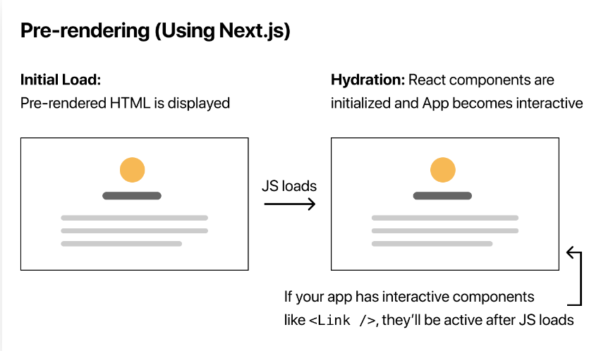
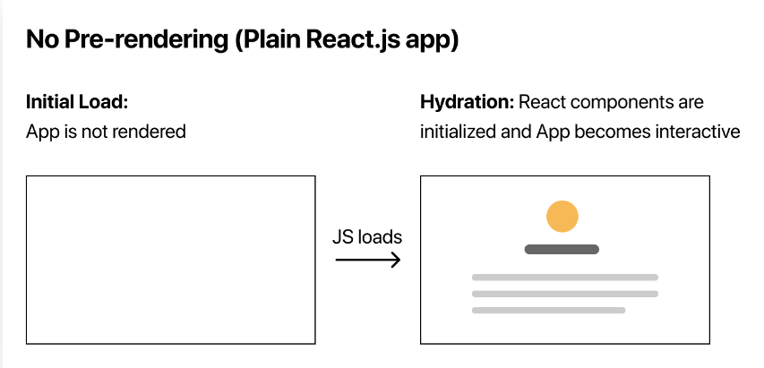
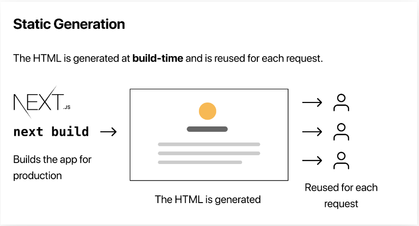
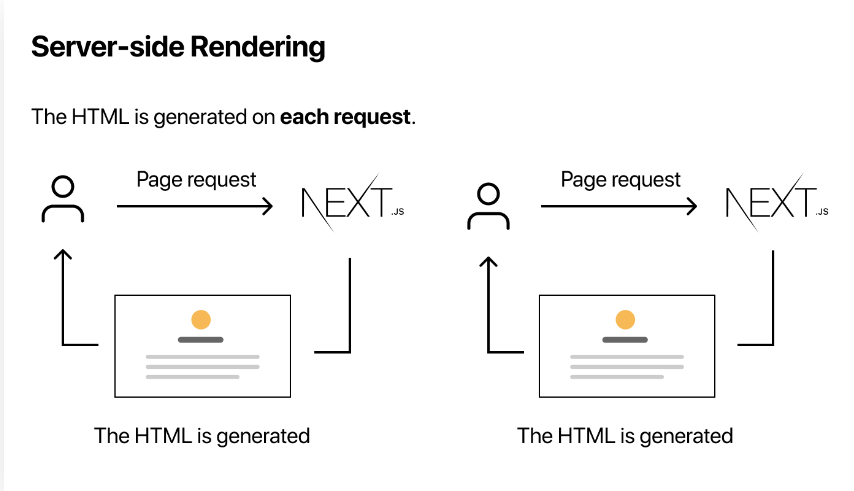
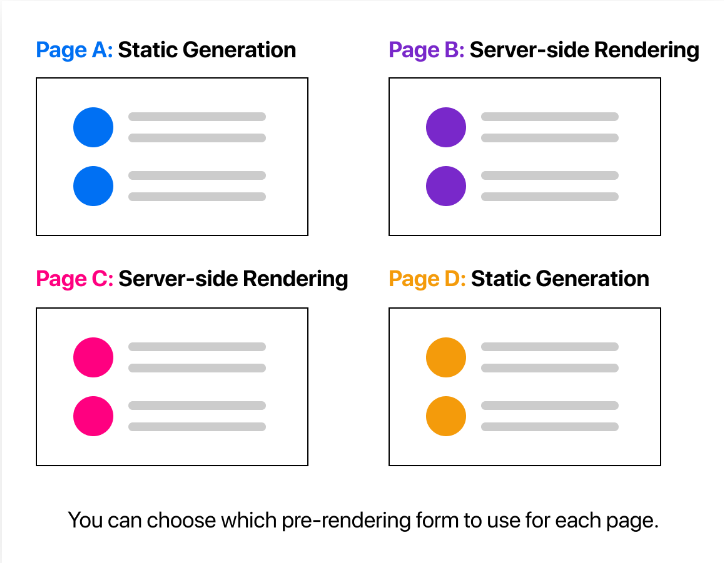

# Pre Rendering

- ### Default Behaviour

- ### Client Side Rendering

- ### Static Site Generation

- ### Server Side Rendering

- In development mode (when you run npm run dev or yarn dev), every page is pre-rendered on each request — even for pages that use Static Generation.

- ### Per Page Basis

## When to Use Static Generation v.s. Server-side Rendering

- You should ask yourself: "Can I pre-render this page ahead of a user's request?" If the answer is yes, then you should choose Static Generation.

- On the other hand, Static Generation is not a good idea if you cannot pre-render a page ahead of a user's request. Maybe your page shows frequently updated data, and the page content changes on every request.

- In that case, you can use Server-side Rendering. It will be slower, but the pre-rendered page will always be up-to-date. Or you can skip pre-rendering and use client-side JavaScript to populate frequently updated data.